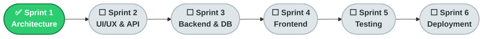

<div align="center">

# 🛍️ E-Commerce Platform
### Consumer Electronics & Tech Accessories — Full-Stack MVP


**A modern, scalable, and user-friendly full-stack shopping platform for tech-savvy consumers — built end-to-end following the complete SDLC.**

**Author:** Ghulam Kabir Soomro &nbsp;•&nbsp; **Roll No:** 2k23/CSM/40 &nbsp;•&nbsp; **Course:** E-Commerce

</div>

---

## 📖 Table of Contents

| # | Section |
|:-:|---|
| 1 | [About the Project](#1--about-the-project) |
| 2 | [Core Features](#2--core-features) |
| 3 | [Tech Stack](#3--tech-stack) |
| 4 | [Project Structure](#4--project-structure) |
| 5 | [Sprint Roadmap](#5--sprint-roadmap) |
| 6 | [Getting Started](#6--getting-started) |
| 7 | [Environment Variables](#7--environment-variables) |
| 8 | [Documentation](#8--documentation) |

---

## 1. 📌 About the Project

This repository hosts a **full-stack e-commerce web application** for consumer electronics and tech accessories — laptops, headphones, gaming gear, chargers, and more.

The project is built as an individual assignment following a complete **Software Development Life Cycle (SDLC)**, delivered across **6 weekly sprints**, from architecture planning through UI/UX design, backend/API development, and final deployment.

> 🎯 **Goal:** A centralized, responsive, and secure shopping experience — fast product discovery, real-time cart management, and a seamless checkout flow.

---

## 2. 🚀 Core Features

| Category | Feature | Priority |
|---|---|:-:|
| 🔐 Authentication | Secure registration & JWT-based login | 🔴 High |
| 🛍️ Catalog | Product browsing, search & category filtering | 🔴 High |
| 🛒 Cart | Add, update, remove, and persist cart items | 🔴 High |
| 💳 Checkout | Mock / Stripe-powered order processing | 🔴 High |
| 🛠️ Admin | CRUD inventory management dashboard | 🟡 Medium |

---

## 3. 🏗️ Tech Stack

| Layer | Technology |
|---|---|
| ⚛️ Frontend | **React.js** |
| 🟢 Backend | **Node.js** + **Express.js** |
| 🍃 Database | **MongoDB Atlas** |
| 🔐 Authentication | **JWT** (JSON Web Tokens) |
| 💳 Payments | **Mock Gateway** / **Stripe** |
| ⚡ Caching *(planned)* | Redis |

```text
Client (React.js) → REST API (Express.js) → Node.js Services → MongoDB Atlas
                                                     │
                                              Payment Gateway
```

---

## 4. 📁 Project Structure

```text
ecommerce-2k23CSM40/
│
├── 📁 client/                 # React.js frontend
│   ├── 📁 src/
│   │   ├── 📁 components/
│   │   ├── 📁 pages/
│   │   ├── 📁 hooks/
│   │   ├── 📁 services/
│   │   ├── 📁 context/
│   │   └── 📁 assets/
│   └── package.json
│
├── 📁 server/                 # Node.js + Express backend
│   ├── 📁 controllers/
│   ├── 📁 models/
│   ├── 📁 routes/
│   ├── 📁 middleware/
│   ├── 📁 services/
│   ├── 📁 utils/
│   ├── 📁 config/
│   └── server.js
│
├── 📁 docs/                   # Sprint documentation
│   └── SPRINT_1.md
│
├── 📄 .env
├── 📄 .gitignore
├── 📄 README.md
└── 📄 package.json
```

---

## 5. 🗺️ Sprint Roadmap

| Sprint | Focus | Status |
|:-:|---|:-:|
| **1** | Architecture & Scope Definition | ✅ **Completed** |
| **2** | UI/UX Design & API Planning | ⬜ Pending |
| **3** | Backend & Database Implementation | ⬜ Pending |
| **4** | Frontend Development & Integration | ⬜ Pending |
| **5** | Testing, Security & Optimization | ⬜ Pending |
| **6** | Deployment & Final Delivery | ⬜ Pending |



---

## 6. ⚙️ Getting Started

### Prerequisites
- Node.js (v18+)
- npm or yarn
- MongoDB Atlas account (or local MongoDB instance)

### Installation

```bash
# Clone the repository
git clone https://github.com/<your-username>/ecommerce-2k23CSM40.git
cd ecommerce-2k23CSM40

# Install backend dependencies
cd server
npm install

# Install frontend dependencies
cd ../client
npm install
```

### Run the App

```bash
# Start backend (from /server)
npm run dev

# Start frontend (from /client)
npm start
```

---

## 7. 🔐 Environment Variables

Create a `.env` file inside `/server` with the following keys:

```env
MONGODB_URI=your_mongodb_connection_string
JWT_SECRET=your_secure_secret
STRIPE_SECRET_KEY=your_stripe_secret
```

> ⚠️ Never commit real secrets to GitHub — `.env` is excluded via `.gitignore`.

---

## 8. 📚 Documentation

| Document | Description |
|---|---|
| [`docs/SPRINT_1.md`](./docs/SPRINT_1.md) | Architecture, MVP scope, tech stack justification & ERD |

---

<div align="center">

**Made with ⚡ as part of the E-Commerce course SDLC project**

</div>
