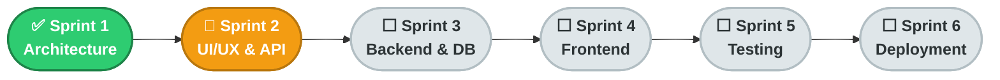

<div align="center">

# 🛍️ E-Commerce Platform
### Consumer Electronics & Tech Accessories — Full-Stack MVP


<br />


<br />

**A modern, scalable, and user-friendly full-stack shopping platform for tech-savvy consumers — built end-to-end following the complete SDLC.**

**Author:** Ghulam Kabir Soomro &nbsp;•&nbsp; **Roll No:** 2k23/CSM/40 &nbsp;•&nbsp; **Course:** E-Commerce

<hr />
</div>

## 📖 Table of Contents

- [1. About the Project](#1--about-the-project)
- [2. Core Features](#2--core-features)
- [3. Tech Stack Architecture](#3--tech-stack-architecture)
- [4. Project Structure](#4--project-structure)
- [5. Sprint Roadmap](#5--sprint-roadmap)
- [6. Getting Started](#6--getting-started)
- [7. Environment Variables](#7--environment-variables)
- [8. Documentation](#8--documentation)

---

## 1. 📌 About the Project

This repository hosts a **full-stack e-commerce web application** specifically designed for consumer electronics and tech accessories, including laptops, headphones, gaming gear, chargers, and more. 

The project is developed as an individual assignment following a rigorous **Software Development Life Cycle (SDLC)**. It will be delivered incrementally across **6 weekly sprints**, evolving from initial architecture planning and UI/UX design to robust backend/API development and final cloud deployment.

> 🎯 **Ultimate Goal:** Deliver a centralized, highly responsive, and secure shopping experience that ensures fast product discovery, seamless real-time cart management, and a frictionless checkout flow.

---

## 2. 🚀 Core Features

| Category | Feature Description | Priority |
|:---|:---|:-:|
| **🔐 Authentication** | Secure user registration & JWT-based session management. | 🔴 High |
| **🛍️ Catalog** | Intuitive product browsing, keyword search, and category filtering. | 🔴 High |
| **🛒 Cart Management** | Real-time add, update, remove actions with state persistence. | 🔴 High |
| **💳 Checkout** | Seamless order processing using Mock/Stripe payment gateway integrations. | 🔴 High |
| **🛠️ Admin Dashboard** | Full CRUD inventory management and order monitoring dashboard. | 🟡 Medium |

---

## 3. 🏗️ Tech Stack Architecture

The application is built using the robust **MERN** stack, complemented by modern tools for a seamless developer and user experience.

| Layer | Technology | Purpose |
|:---|:---|:---|
| ⚛️ **Frontend** | **React.js** | Building a dynamic, component-based user interface. |
| 🟢 **Backend** | **Node.js** + **Express.js** | High-performance, event-driven RESTful API server. |
| 🍃 **Database** | **MongoDB Atlas** | Flexible, scalable NoSQL document database. |
| 🔐 **Authentication** | **JWT** | Secure, stateless JSON Web Token user authentication. |
| 💳 **Payments** | **Stripe** | Secure mock and live payment processing. |

### System Flow
```text
Client (React.js)  ━━━━▶  REST API (Express.js)  ━━━━▶  Node.js Services  ━━━━▶  MongoDB Atlas
                                                           │
                                                           ▼
                                                    Payment Gateway
```

---

## 4. 📁 Project Structure

```text
ecommerce-2k23CSM40/
│
├── 📁 client/                 # React.js frontend application
│   ├── 📁 src/
│   │   ├── 📁 components/     # Reusable UI components
│   │   ├── 📁 pages/          # Application views/pages
│   │   ├── 📁 hooks/          # Custom React hooks
│   │   ├── 📁 services/       # API integration functions
│   │   ├── 📁 context/        # Global state management
│   │   └── 📁 assets/         # Images, icons, global styles
│   └── package.json
│
├── 📁 server/                 # Node.js + Express backend application
│   ├── 📁 controllers/        # Request handling logic
│   ├── 📁 models/             # Mongoose database schemas
│   ├── 📁 routes/             # Express API routing
│   ├── 📁 middleware/         # Auth, validation, and error handling
│   ├── 📁 services/           # Business logic layer
│   ├── 📁 config/             # Environment and DB configurations
│   └── server.js              # Application entry point
│
├── 📁 docs/                   # SDLC documentation and Sprint deliverables
│   └── SPRINT_1.md            
│
├── 📄 .env                    # Root environment configurations
├── 📄 .gitignore
└── 📄 README.md
```

---

## 5. 🗺️ Sprint Roadmap

We are following an iterative agile approach. Below is the progress tracking for the project:

| Sprint | Focus Area | Status |
|:-:|:---|:-:|
| **1** | Architecture & Scope Definition | ✅ **Completed** |
| **2** | UI/UX Design & API Planning | 🔄 **In Progress** |
| **3** | Backend & Database Implementation | ⬜ Pending |
| **4** | Frontend Development & Integration | ⬜ Pending |
| **5** | Testing, Security & Optimization | ⬜ Pending |
| **6** | Deployment & Final Delivery | ⬜ Pending |

<br/>


```mermaid
flowchart LR
    S1(["✅ Sprint 1<br>Architecture"]) --> S2(["🔄 Sprint 2<br>UI/UX & API"])
    S2 --> S3(["⬜ Sprint 3<br>Backend & DB"])
    S3 --> S4(["⬜ Sprint 4<br>Frontend"])
    S4 --> S5(["⬜ Sprint 5<br>Testing"])
    S5 --> S6(["⬜ Sprint 6<br>Deployment"])

    classDef done fill:#2ECC71,stroke:#1E8449,stroke-width:2px,color:#ffffff,font-weight:bold;
    classDef inprogress fill:#F39C12,stroke:#B9770E,stroke-width:2px,color:#ffffff,font-weight:bold;
    classDef pending fill:#DFE6E9,stroke:#B2BEC3,stroke-width:2px,color:#2D3436,font-weight:bold;

    class S1 done;
    class S2 inprogress;
    class S3,S4,S5,S6 pending;
```

---

## 6. ⚙️ Getting Started

Follow these steps to set up the project locally.

### Prerequisites
Make sure you have the following installed:
- [Node.js](https://nodejs.org/) (v18 or higher)
- npm or yarn
- [MongoDB Atlas](https://www.mongodb.com/cloud/atlas) account (or a local MongoDB instance)

### Installation

**1. Clone the repository:**
```bash
git clone https://github.com/your-username/ecommerce-2k23CSM40.git
cd ecommerce-2k23CSM40
```

**2. Install Backend Dependencies:**
```bash
cd server
npm install
```

**3. Install Frontend Dependencies:**
```bash
cd ../client
npm install
```

### Run the Application

You will need two terminal windows to run both the server and client simultaneously.

```bash
# Terminal 1: Start backend server (from /server)
npm run dev

# Terminal 2: Start frontend client (from /client)
npm start
```

---

## 7. 🔐 Environment Variables

To run this project, you will need to add the following environment variables. Create a `.env` file inside the `/server` directory:

```env
# Database
MONGODB_URI=your_mongodb_connection_string

# Authentication
JWT_SECRET=your_secure_jwt_secret
JWT_EXPIRE=30d

# Payments (Stripe)
STRIPE_SECRET_KEY=your_stripe_secret
STRIPE_WEBHOOK_SECRET=your_stripe_webhook_secret

# Server
PORT=5000
NODE_ENV=development
```

> ⚠️ **Security Note:** Never commit your real `.env` files to GitHub. Make sure it is included in your `.gitignore`.

---

## 8. 📚 Documentation

Detailed documentation for each phase of the Software Development Life Cycle (SDLC) can be found in the `docs` folder.

| Document | Description |
|:---|:---|
| 📑 [`SPRINT_1.md`](./docs/SPRINT_1.md) | Initial Architecture, MVP scope, tech stack justification, and Entity-Relationship Diagram (ERD). |

<br />
<br />

<div align="center">
  <b>Built with passion ⚡ for the E-Commerce SDLC Project</b><br>
  <i>Ghulam Kabir Soomro &copy; 2024</i>
</div>
