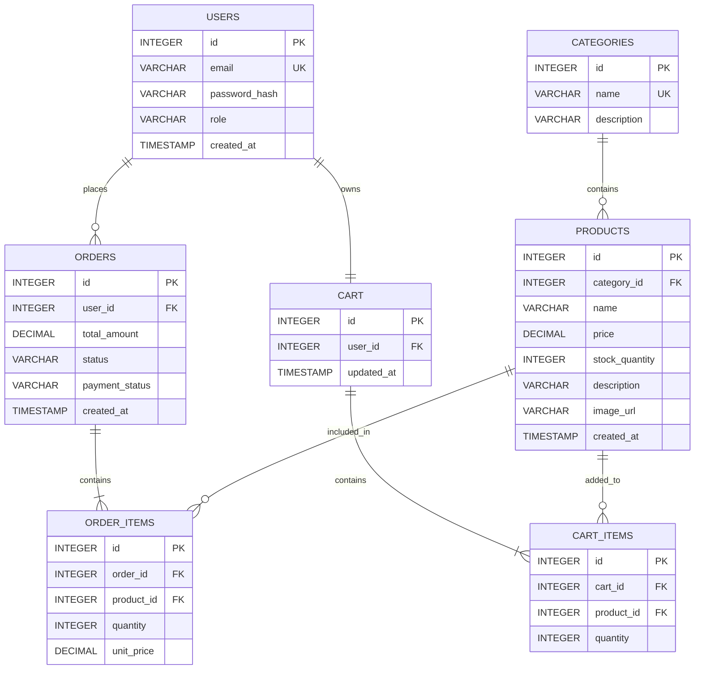

## Sprint 1 — Architecture & Scope Definition

 

  
**Author:** Ghulam Kabir Soomro &nbsp;•&nbsp; **Roll No:** 2k23/CSM/40 &nbsp;•&nbsp; **Repository:** `ecommerce-2k23CSM40`

## ✅ Table of Contents

| # | Section |
|:-:|---|
| 1 | [Target Audience & Market Focus](#1--target-audience--market-focus) |
| 2 | [MVP Feature Scope Matrix](#2--minimum-viable-product-mvp-feature-scope) |
| 3 | [Tech Stack Selection & Justification](#3--tech-stack-selection--justification) |
| 4 | [Entity-Relationship Diagram (ERD)](#4--entity-relationship-diagram-erd) |
---

## 1. 🎯 Target Audience & Market Focus

👤 Primary PersonaYoung, tech-savvy retail consumers and early adopters who prefer fast, convenient and reliable online shopping for gadgets and tech accessories and are comfortable with digital platforms, expect quick product discovery, and value secure, transparent transactions.
💡 Core Pain PointExisting shopping experiences are often cluttered, slow during product discovery, inconsistent when updating cart data, and complicated at checkout — leading to friction and cart abandonment. Users need a centralized, responsive and secure platform where discovery, cart management and checkout feel effortless.
🌐 Domain ScopeConsumer Electronics & Tech Accessories — including laptops, computer peripherals, headphones/earbuds, chargers, mobile accessories, monitors, storage, gaming accessories and power banks.

> Scope Principle: The domain is intentionally kept narrow enough for a semester-feasible MVP while the architecture is designed to support additional product categories in future sprints.
---

## 2. 🚀 Minimum Viable Product (MVP) Feature Scope

| Category | Feature Name | Description | Priority |
|---|---|:--|:-:|
| 🔐 Authentication | User Registration & Auth | Secure account registration with password hashing and JWT-based authentication. | 🔴 High (MVP) |
| 🛍️ Catalog | Product List & Search | Product browsing interface with taxonomy-based category filtering and keyword search. | 🔴 High (MVP) |
| 🛒 Cart | Cart Management | State-persistent cart operations — add, update quantity, remove and clear items. | 🔴 High (MVP) |
| 💳 Checkout | Order Processing | Mock / Stripe payment gateway integration with order object instantiation. | 🔴 High (MVP) |
| 🛠️ Admin | Inventory Control | Administrative CRUD operations for managing product inventory. | 🟡 Medium |

### 🔄 Core User Flow

---

## 3. 🏗️ Tech Stack Selection & Justification

### ⚛️ Frontend — React.js
> Justification: React's component-based architecture is highly suited for dynamic, state-heavy interfaces such as shopping carts, live search/filtering, and checkout flows. Its efficient virtual-DOM rendering and large ecosystem (React Router, Context API) enable rapid, maintainable UI development compared to alternatives such as Vue.js.

### 🟢 Backend — Node.js + Express.js
> Justification: Node.js's non-blocking, event-driven runtime handles many concurrent API requests efficiently — well suited for catalog browsing and cart operations under load. Express.js adds a lightweight routing and middleware layer for authentication, validation, and error handling, offering faster iteration than heavier frameworks such as Spring Boot for an MVP timeline.

### 🍃 Database — MongoDB Atlas
> Justification: As a NoSQL document database, MongoDB provides flexible schema design — ideal as products across categories (laptops, cables, power banks) carry different attributes. MongoDB Atlas adds managed cloud hosting and horizontal scalability. Trade-off: relational integrity (e.g. foreign-key enforcement) must be handled at the application/service layer rather than the database layer, compared to PostgreSQL/MySQL.

### ⚡ Caching (Optional — Future Scope)
> Redis is earmarked for a future sprint to cache frequently-accessed product listings and manage session/cart persistence at scale.

### 📊 Stack Summary

| Layer | Choice | Key Alternative Considered |
|---|---|---|
| Frontend | React.js | Vue.js |
| Backend | Node.js + Express.js | Django / Spring Boot |
| Database | MongoDB Atlas | PostgreSQL |
| Auth | JWT | Session-based Auth |
| Payments | Mock / Stripe | PayPal |
---

## 4. 🧩 Entity-Relationship Diagram (ERD)

### 📐 Relationship Cardinality Summary

| Relationship | Cardinality | Description |
|---|:-:|---|
| Users → Orders | 1 : N | A user can place many orders |
| Users → Cart | 1 : 1 | A user owns exactly one active cart |
| Categories → Products | 1 : N | A category contains many products |
| Orders → Order_Items | 1 : N | An order contains many order line-items |
| Products → Order_Items | 1 : N | A product can appear in many order-items |
| Cart → Cart_Items | 1 : N | A cart holds many cart-items |
| Products → Cart_Items | 1 : N | A product can appear in many cart-items |

### 🗺️ Diagram

### 🔑 Key Constraints

| Entity | Primary Key | Foreign Key(s) |
|---|---|---|
| Users | `id` | — |
| Categories | `id` | — |
| Products | `id` | `category_id → Categories.id` |
| Orders | `id` | `user_id → Users.id` |
| Order_Items | `id` | `order_id → Orders.id`, `product_id → Products.id` |
| Cart | `id` | `user_id → Users.id` |
| Cart_Items | `id` | `cart_id → Cart.id`, `product_id → Products.id` |
---

### ✅ Sprint 1 Status
✅
Architecture
Defined
➜
✅
MVP
Scoped
➜
✅

Tech Stack
Justified
➜
✅
ERD
Modeled
➜
🚀
Sprint 2
Ready

