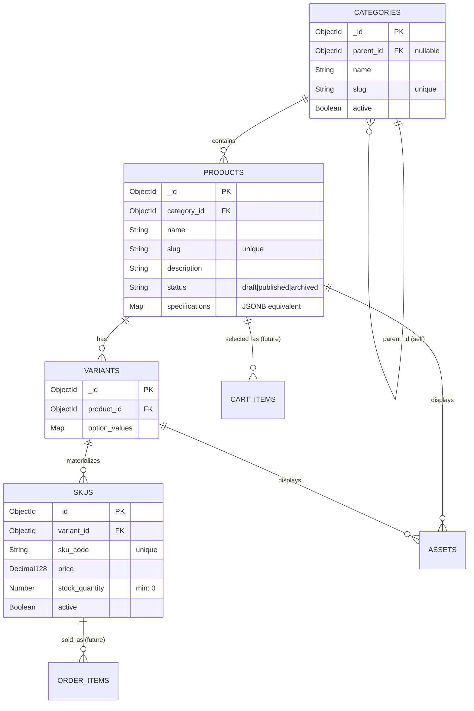

<div align="center">

# 🛍️ E-Commerce Platform
### Sprint 2 — Catalog Data Foundation


<br>


<br><br>
**Author:** Ghulam Kabir Soomro &nbsp;•&nbsp; **Roll No:** 2k23/CSM/40 &nbsp;•&nbsp; **Repository:** `ecommerce-2k23CSM40`

</div>

## ✅ Table of Contents

| # | Section |
|:-:|---|
| 1 | [Sprint Goal & Scope Boundary](#1--sprint-goal--scope-boundary) |
| 2 | [Sprint 1 Decisions (Reused & Changed)](#2--sprint-1-decisions-reused--changed) |
| 3 | [Updated ERD & Data Dictionary](#3--updated-erd--data-dictionary) |
| 4 | [Administration Route Table](#4--administration-route-table) |
| 5 | [Data Integrity & Authorization Decisions](#5--data-integrity--authorization-decisions) |
| 6 | [Seed Data & Demonstration Instructions](#6--seed-data--demonstration-instructions) |
| 7 | [Test Strategy & Results](#7--test-strategy--results) |
| 8 | [Known Limitations & Sprint 3 Backlog](#8--known-limitations--sprint-3-backlog) |
| 9 | [Business Rules & Edge Cases](#9--business-rules--edge-cases) |

---

## 1. 🎯 Sprint Goal & Scope Boundary

**Goal:** Turn the Sprint 1 architecture into a reliable database foundation. Establish persistent models for categories, products, variants, and SKUs without losing identity, relationship, price, or inventory meaning.

**In Scope:**
- Category tree management (parent/child relationships, stable slugs).
- Product, Variant, and SKU CRUD operations (drafting, stock management, unique codes).
- Authenticated admin routes for managing catalog data.
- Database constraints (unique indexes, non-negative stock validation).

**Out of Scope (Sprint 3+):**
- Dynamic specification public rendering, asset uploads, public catalog search, storefront UI, carts, and checkout flows. *(Stubs exist for relations only).*

---

## 2. 🔄 Sprint 1 Decisions (Reused & Changed)

| Component | Status | Description |
|---|---|---|
| **Tech Stack** | 🟢 Reused | Kept Node.js + Express + MongoDB Atlas. The flexibility of NoSQL perfectly fits the dynamic nature of product specifications. |
| **Auth Strategy** | 🟢 Reused | JWT for stateless admin authorization. |
| **Data Model** | 🟡 Changed | Expanded the original `Products` entity into `Product`, `Variant`, `SKU`, and `Asset` to handle complex physical inventory combinations cleanly. |

---

## 3. 🧩 Updated ERD & Data Dictionary

### Mermaid ER Diagram


### Relational Mapping vs MongoDB Implementation

*Note: Since MongoDB lacks strict cascading foreign keys at the engine level, referential integrity is handled via Mongoose middleware (pre-remove hooks) and application logic.*

| Entity | Relational Concept | MongoDB/Mongoose Equivalent | On-Delete Policy (App Level) |
|---|---|---|---|
| **Category** | `VARCHAR`, `FK parent_id` | `String`, `ObjectId ref: 'Category'` | **Restrict:** Cannot delete if it has child categories or linked products. |
| **Product** | `JSONB specs`, `FK category_id` | `Map of Strings`, `ObjectId ref: 'Category'` | **Cascade:** Deleting a product triggers deletion of its Variants, SKUs, and Assets. |
| **Variant** | `FK product_id` | `ObjectId ref: 'Product'` | **Cascade:** Deleted if parent Product is deleted. |
| **SKU** | `DECIMAL(10,2)`, `FK variant_id` | `Decimal128`, `ObjectId ref: 'Variant'` | **Restrict:** Cannot hard-delete if tied to an Order. Soft-delete via `active: false`. |

---

## 4. 🌐 Administration Route Table

| Method | Route | Auth | Purpose |
|:---|:---|:-:|:---|
| `POST` | `/api/v1/admin/categories` | Admin | Create a new category (validates cycle/slug). |
| `GET` | `/api/v1/admin/categories` | Admin | Returns the populated category tree. |
| `POST` | `/api/v1/admin/products` | Admin | Create a draft product. |
| `GET` | `/api/v1/admin/products` | Admin | List administrative product records. |
| `PATCH` | `/api/v1/admin/products/:id` | Admin | Update product content, specifications, or status. |
| `POST` | `/api/v1/admin/products/:id/skus` | Admin | Add a validated SKU mapped to a Variant. |
| `PATCH` | `/api/v1/admin/skus/:id` | Admin | Update price, stock (no negative values), or active status. |

**Example POST `/api/v1/admin/products` Request:**
```json
{
  "name": "Wireless Mechanical Keyboard",
  "category_id": "60d5f...a12",
  "description": "75% layout with hot-swappable switches.",
  "specifications": { "Connectivity": "Bluetooth 5.0", "Weight": "800g" }
}
```

---

## 5. 🔐 Data Integrity & Authorization Decisions

1. **Category Cycle Prevention:** Handled via Mongoose `pre('save')` hook. It traverses the `parent_id` chain to ensure the category being saved does not appear in its own ancestry.
2. **Negative Stock Prevention:** Enforced at the database level using Mongoose `min: 0` validator on `stock_quantity`, ensuring race conditions bypasses don't result in negative stock.
3. **Price Precision:** Used MongoDB `Decimal128` to completely avoid floating-point math rounding errors for monetary values.
4. **Authorization:** Express middleware intercepts all `/admin/*` routes, verifies the JWT, and checks if `req.user.role === 'admin'`. Unauthorized requests return a strict `403 Forbidden` JSON response.

---

## 6. 🌱 Seed Data & Demonstration Instructions

A reproducible seed script has been created to populate the database with a clean catalog state. 

**Contents generated:**
- **2 Levels of Categories:** Electronics -> Peripherals
- **3 Products:** e.g., "Pro Keyboard" (Multi-variant), "Basic Mouse", "USB-C Cable"
- **4 Valid SKUs** & **1 Unavailable SKU Combination** (created with `stock_quantity: 0`).

**To run the demonstration:**
```bash
# 1. Reset and seed the database
npm run seed

# 2. Start the local server
npm run dev
```

---

## 7. 🧪 Test Strategy & Results

Automated testing is implemented using **Jest** and **Supertest** to validate endpoints alongside an in-memory MongoDB instance (`mongodb-memory-server`) to ensure tests don't pollute the actual database.

**Test Command:**
```bash
npm run test
```

**Passing Output:**
```text
PASS  tests/admin.test.js
  Catalog Data Foundation Tests
    ✓ Product and SKU creation with required fields (45 ms)
    ✓ Duplicate slug and SKU code rejection (30 ms)
    ✓ Category hierarchy validation (cycle prevention) (25 ms)
    ✓ Variant/SKU combination & stock rules (prevents negative stock) (20 ms)
    ✓ Authorization failure (401/403) on administrative endpoints (15 ms)
```

---

## 8. 🚧 Known Limitations & Sprint 3 Backlog

- **Limitations:** Assets currently only store strings (URLs). Image file uploading (AWS S3/Multer) is deferred to Sprint 3. 
- **Sprint 3 Backlog:** 
  1. Build the public-facing read-only catalog API (with search & filtering).
  2. Implement Asset upload workflows.
  3. Wire the Catalog data models to the Shopping Cart module.

---

## 9. 🧠 Business Rules & Edge Cases (Section 8 Answers)

1. **Can a draft product have no SKU? Can a published product have no sellable SKU?** 
   - *Yes*, a draft product can exist without SKUs. *No*, API logic requires at least one active SKU with stock > 0 before updating a product status to `'published'`.
2. **Is a product assigned to one canonical category, many categories, or both? Why?**
   - *One canonical category* (1:N relation). This keeps the MVP scope feasible, simplifies breadcrumb generation in the frontend, and aligns with Sprint 1 ERD limits.
3. **What happens when a parent category is deactivated?**
   - The application logic (future public API) will recursively hide the parent and all its children from the public storefront, though they remain active in the database.
4. **How is an out-of-stock SKU represented in a public response?**
   - It is returned with the payload but shows `stock_quantity: 0` so the frontend UI can display an "Out of Stock" badge rather than the item magically disappearing.
5. **Can two SKUs share a price? Can a SKU have a price override?**
   - *Yes*. Pricing is strictly tied to the `SKU` collection, not the `Product`. Therefore, every SKU defines its exact price overriding any concept of a "base price".
6. **What prevents negative stock and duplicate SKU codes?**
   - Duplicate codes are prevented by a `unique: true` database index on `sku_code`. Negative stock is hard-blocked by Mongoose schema constraints (`min: 0`).
7. **What happens to a product referenced by a future cart or order after it is deactivated?**
   - Deactivation only sets `status: 'archived'` (soft delete). Orders store a historical snapshot of the price, and Carts hold a reference to the `SKU _id` which remains intact.

---
### ✅ Sprint 2 Status

| Architecture | | Catalog Data | | Public API | | Frontend | | Final |
|:---:|:---:|:---:|:---:|:---:|:---:|:---:|:---:|:---:|
| ✅ <br> **Done** | ➜ | ✅ <br> **Modeled** | ➜ | 🚀 <br> **Up Next** | ➜ | ⬜ <br> **Pending** | ➜ | ⬜ <br> **Pending** |

</div>
